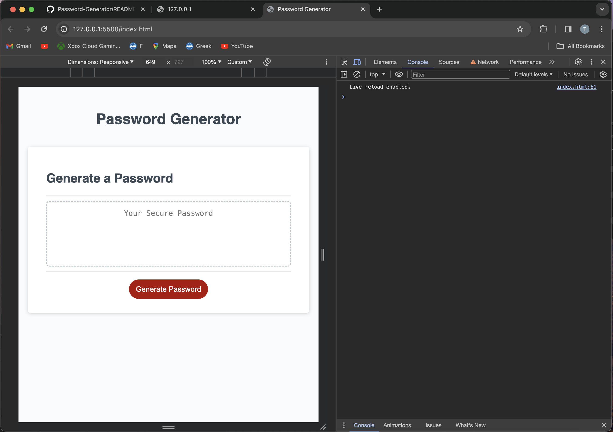

# Password Generator

<a name="readme-top"></a>

  <h3 align="center">Password Generator</h3>

  <p align="center">
    A powerful tool for generating secure passwords using JavaScript.
    <br />
    <a href="https://github.com/your-github-username/Password-Generator"><strong>
    <br />
    <br />
    <a href="https://your-github-username.github.io/Password-Generator/">View Demo</a>
    ·
    <a href="https://github.com/your-github-username/Password-Generator/issues">Report Bug</a>
    ·
    <a href="https://github.com/your-github-username/Password-Generator/issues">Request Feature</a>
  </p>
</div>

<!-- TABLE OF CONTENTS -->
<details>
  <summary>Table of Contents</summary>
  <ol>
    <li><a href="#about-the-project">About The Project</a></li>
    <li><a href="#how-it-works">How It Works</a></li>
    <li><a href="#usage">Usage</a></li>
    <li><a href="#output-format">Output Format</a></li>
    <li><a href="#built-with">Built With</a></li>
    <li><a href="#getting-started">Getting Started</a></li>
    <li><a href="#roadmap">Roadmap</a></li>
    <li><a href="#contributing">Contributing</a></li>
    <li><a href="#license">License</a></li>
    <li><a href="#contact">Contact</a></li>
    <li><a href="#acknowledgments">Acknowledgments</a></li>
  </ol>
</details>

<!-- ABOUT THE PROJECT -->
## About The Project



<p align="right">(<a href="#readme-top">back to top</a>)</p>

### How It Works

The Password Generator tool uses JavaScript to create secure and customizable passwords. Here's how it functions:

- **Generation**: Generates passwords based on user-defined criteria like length and character types.
- **Security**: Ensures the generated passwords meet security standards by including a mix of uppercase, lowercase, numbers, and special characters.
- **Flexibility**: Allows users to specify the length and types of characters they want in their passwords.
- **Ease of Use**: Provides a straightforward interface for generating passwords quickly.

### Usage

To utilize the Password Generator:

1. **Clone the Repository**: Clone the 'Password-Generator' repository to your local machine.
2. **Specify Criteria**: Open the `index.js` file and adjust the settings to define the password criteria (e.g., length, character types).
3. **Generate Password**: Run the script in a JavaScript runtime environment or a web browser console to produce a secure password.
4. **Retrieve Password**: Copy the generated password for use in your desired application.

### Output Format

The generated password will display in the console or interface as:

```
Generated Password: [Your Secure Password]
```

<p align="right">(<a href="#readme-top">back to top</a>)</p>

### Built With

This project was constructed using:

* [JavaScript](https://www.javascript.com)

<p align="right">(<a href="#readme-top">back to top</a>)</p>

<!-- GETTING STARTED -->
## Getting Started

To set up a local copy of the Password Generator, follow these steps.

### Prerequisites

No prerequisites are required for this project.

### Installation

1. Clone the repo
   ```sh
   git clone https://github.com/your-github-username/Password-Generator.git
   ```
2. Navigate to the `index.js` file to configure your password generation settings.

<p align="right">(<a href="#readme-top">back to top</a>)</p>

<!-- ROADMAP -->
## Roadmap

- [x] Initial release with basic password generation functionality
- [ ] Add advanced password generation features
- [ ] Implement user interface enhancements for ease of use

See the [open issues](https://github.com/your-github-username/Password-Generator/issues) for a complete list of proposed features and known issues.

<p align="right">(<a href="#readme-top">back to top</a>)</p>

<!-- CONTRIBUTING -->
## Contributing

Your contributions are highly appreciated. To contribute:

1. Fork the Project
2. Create your Feature Branch (`git checkout -b feature/AmazingFeature`)
3. Commit your Changes (`git commit -m 'Add some AmazingFeature'`)
4. Push to the Branch (`git push origin feature/AmazingFeature`)
5. Open a Pull Request

<p align="right">(<a href="#readme-top">back to top</a>)</p>

<!-- LICENSE -->
## License

Distributed under the MIT License. See `LICENSE.txt` for more details.

<p align="right">(<a href="#readme-top">back to top</a>)</p>

<!-- CONTACT -->
## Contact

Email - your-email@example.com

Project Link: [https://your-github-username.github.io/Password-Generator/]

<p align="right">(<a href="#readme-top">back to top</a>)</p>

<!-- ACKNOWLEDGMENTS -->
## Acknowledgments

* [Node.js](https://nodejs.org/)
* [GitHub](https://github.com/)

<p align="right">(<a href="#readme-top">back to top</a>)</p>

--- 

Please replace placeholders such as `your-github-username` and `your-email@example.com` with appropriate details.
